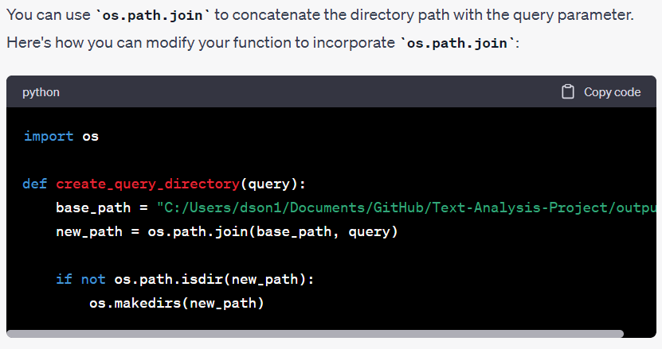

# Text-Analysis-Project
 
## 1. Project Overview

I used News API's "Everything" endpoint and added a query input feature so that users can get a list of news articles via the CLI akin to a Google Search. At a high level, I hoped to create a way to quickly generate the overall sentiment in the news of a given query. In testing, I realized searching for certain political terms/figures in conjunction with a sentiment analysis could provide insight into potential biases of a given news source, thus *shifting my analysis to the source of news itself via various queries*, something I will explain further below. Unfortunately, the free version I used limited my API calls to 100 articles in the past 30 days, but I included a function that would in theory enable someone with a paid version to generate a significantly larger sample size for better analysis.

**Techniques used to process the data included the following:**
1. Consolidating the relevant data fields (title, content, article description) for analysis.
2. Formatting the API's output into a list data structure of news articles for integration with other libraries.
3. Filtering out non-insightful words/noise from the text data that I analyzed, which included stop words, and other miscellaneous text like "chars" or "li" that the News API returned. 

**Techniques used to analyze the data included the following:**
1. A word count histogram 
2. A word cloud 
3. Sentiment analysis via nltk.sentiment.vader library
4. Cross-comparison of sentiment between different search queries (Donald Trump and Joe Biden) (using Excel after generating .csv files with Python)

## 2. Implementation

**extract_news_data.py**
The API calls, most of the data parsing, data plotting, and data saving occur in extract_news_data.py, in that order. I tried to break out each major step as separate functions that feed into each other in main(). Though the API returns a dictionary, I only focused  on the actual news data, which was a list that contained pertinent info of each news article as dictionary elements. From the news data in this list, I conducted most of my data cleaning, combining, and plotting. The most complex algorithm here would be the track_and_rank_sources function, something I chose to implement because *I wanted to analyze the news sources themselves by calculating sentiment of different topics*. I made the decision after realizing that due to News API's character limit, computing text analyses on an individual article basis did not yield much insight. Instead by shifting the focus of my analysis to *the sources rather than the query* I could effectively circumvent the API's limitations.

**text_analysis.py**
Most of the text analysis statistics (histogram, sentiment analysis, etc.) are functions in text_analysis.py because, from the onset of the assignment, I foresaw myself reusing some of the more general functions for future text analysis needs. I primarily used a dictionary data structure for these functions. The algorithms here were variations on sorted() or for loops to iterate through the words in the data set or filter out stop words. Near the end of the file, I have two functions dedicated to navigating a sample data set by entry by taking user inputs, but I did not use this function for analyzing the news api data because this function becomes increasingly impractical for each additional element to analyze.

**How I used ChatGPT**
I used ChatGPT to assist in implementing the folder/file system using the os library, which I initially had a hard time understanding via the documentation. 

 

I also used ChatGPT to implement the matplotlib library, as the documentation assumed the user used Numpy and Pandas in conjunction, which I did not.

## 3. Results 

**Output**
Each query generates summary statistics in the form of a histogram and wordcloud of common words as well as a .csv file of the news_data and sources_data for future reference and exportability. All example figures can be found under "output/Donald Trump" or "output/Joe Biden." 

**Analysis**
During initial run throughs of my text analysis, I found based on the word cloud I generated for each query that the program was coming across a high frequency "li," "ul," and "chars" in the text data. After a bit of investigation, I realized "li" and "ul" were html tags that I assume the News API web-scraper would miss at times and "char" was a placeholder in the "content" of each article it returned. This led me to create a short script that would further clean the article content data as mentioned previously before combining it for analysis. Moreover, it told me that I should look for alternatives to News API with better scraping capabilities should I wish to pursue this project further.

A more obvious result were the high frequencies of the search terms themselves. For example, "Trump" and "Donald" take up the top two most frequent words in the 100 articles based on the query "Donald Trump" (see "output/Donald Trump/Donald Trump_histogram.png"). Although I considered removing the query terms from the word count histogram/wordcloud, I decided against it after I noticed "president" and "Israel" overtaking "Joe" for the query "Joe Biden." By including the search terms, one could identify cases like the one for "Joe Biden" in which a non-query term overtakes a query term, which could have substantial implications depending on the non-query term.

In terms of actual analysis, I compared the sentiment between search queries "Donald Trump" and "Joe Biden" by exporting the pertinent data and creating graph views in Excel (See output/sample). Based on my admittedly limited sample size, it appears that of the sources that feature both Trump and Biden (NPR, BBC, BusinessInsider, Wired), news organizations tend to feature Biden in a more favorable light based on his higher compound sentiment score on average with the one exception being the BBC, which Trump barely edges past Biden.

## 4. Reflection

**From a process point of view, what went well? What could you improve? Did you have a good testing plan? Was your project appropriately scoped?**
Once I had a concrete idea of what exactly I wanted to know from the dataset, I felt myself able to focus my efforts better and make faster progress. An area I could improve in is getting a more complete understanding of the libraries . For example, I probably could have plotted all of my data using matplotlib, but my limited experience meant I would be a lot more efficient if I simply exported the data as a .csv file and built out the data visualization in Excel. I am sure this is something that will come with practice. To initially get the code to work, I spent most of my time testing various text analysis methods by creating the functions in text_analysis.py. Once I familiarized myself with what tools I could use and deciding upon what I wanted to analyze from the dataset, I limited queries when testing the news api in the extract_news_data.py file to "Donald Trump" so that I would not get distracted by changing data. Afterwards, my testing plan involved trying various search queries to ensure the output was consistent with the expectations I had following my many tests with the original query. I believe my project was appropriately scoped as I managed to familiarize myself with a few new python libraries over the course of the assignment.

**From a learning perspective, mention what you learned through this project, how ChatGPT helped you, and how you'll use what you learned going forward. What do you wish you knew beforehand that would have helped you succeed?**
From a learning perspective, I asked ChatGPT for code review after writing out my version of certain functions. In doing so, it forced me to read ChatGPT's output and actually understand what the code it gave would do since simply copy and pasting would likely cause errors given the heavy integration I have across various functions. I also used stack overflow in conjunction with ChatGPT to understand the syntax of the os and matplotlib libraries. I wish I had known to write my code using numpys and pandas, since these are essential libraries for analysis and by the time I had realized, I had already written most of the program to integrate best with the list structure I was using.
